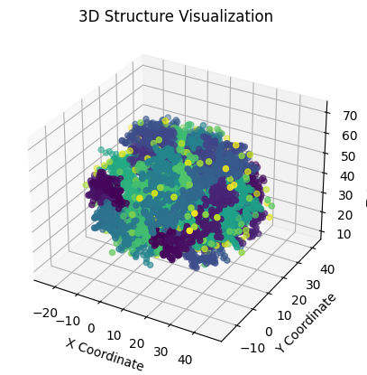

# 🧬 Protein Structure Prediction Using CNN-Based Feature Extraction

> **Reference Paper**: [A CNN-Based Approach for Protein Structure Prediction Using Feature Extraction and Ensemble Learning](https://ieeexplore.ieee.org/document/11032318) (IEEE Access)



This repository presents a machine learning-based approach to **predict protein structures** using advanced feature extraction and ensemble learning. It combines **Convolutional Neural Networks (CNN)** for feature extraction with a **stacking ensemble** of classifiers: **Support Vector Machine (SVM)**, **Artificial Neural Network (ANN)**, and **Random Forest (RF)**.

---

## 📚 Abstract

Predicting protein structures is crucial for understanding biological functions and facilitating drug discovery. This project leverages a stacking-based machine learning framework that integrates multiple models to enhance predictive accuracy. CNNs are used to extract meaningful features from protein sequences, and these features are passed to SVM, ANN, and RF models. The ensemble of their outputs boosts overall performance and reliability.

---

## 🧪 Methodology

1. **Feature Extraction**:
   - Use of CNN to extract spatial features from protein sequences.

2. **Model Training**:
   - Train three base models: SVM, ANN, and RF on the extracted features.

3. **Ensemble (Stacking)**:
   - Combine the predictions of base models using a meta-classifier to improve robustness and accuracy.

4. **Evaluation**:
   - Compare model performances using metrics such as accuracy, precision, and recall.

---

## 📝 Requirements

- Python 3.8+
- NumPy
- Pandas
- Scikit-learn
- TensorFlow or Keras
- Matplotlib
- Seaborn
- Jupyter Notebook

Install requirements via:

```bash
pip install -r requirements.txt
```

---

## 📈 Results

- The stacking model significantly outperforms individual models.
- CNN feature extraction provides a powerful representation of protein sequences.
- Ensemble predictions show greater stability and accuracy across various protein structures.

---

## 📚 Authors

- Ahmad Raza  
- Sourav Mondal  
- Saranya Nayudu  
- Nagireddy Anjali  
- M. Mahendar Reddy

---

## 🧠 Keywords

Protein Structure Prediction · CNN · Feature Extraction · SVM · ANN · Random Forest · Ensemble Learning
